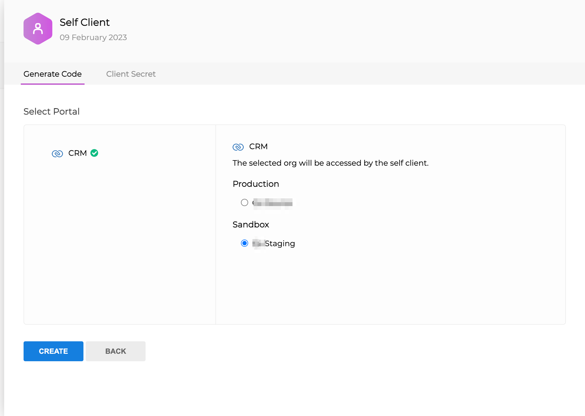

# zoho-client-django

A modest Zoho CRM API client which will do the oAuth2 for you.

## Usage

```python
 from zoho_client.zoho import ZohoClient
 client = ZohoClient()
 # GET all Sales_Orders
 res = client.make_request(api_endpoint="Sales_Orders")
 for sales_order in res['data']:
    print(f"sales order #{sales_order['id']}")

 # find the first record
 sales_order_id = res['data'][0]['id']

 # update the sales order's subject
 payload = {'data': [ {'Subject': 'CHNAGED'}]}
 res = client.make_request(method='PUT', api_endpoint=f"Sales_Orders/{sales_order_id}", data=payload)
 print(res['data'][0]['status'])
 # => success

```

# Setup

## ENV

the package expects to have it's configuration in the settings.py:

```python
# read it from .env
ZOHO_CLIENT_ID = env("ZOHO_CLIENT_ID")
ZOHO_CLIENT_SECRET = env("ZOHO_CLIENT_SECRET")
ZOHO_API_VERSION = "v2.1"
# sandbox
ZOHO_BASE_URL = "https://crmsandbox.zoho.com"
# production
# ZOHO_BASE_URL = "https://zohoapis.com"
```

and naturally, don't forget to include the app in your INSALLED_APS:

```python
INSTALLED_APPS = [
    ...
    "zoho_client",
]

```

## Initilization of the client (one off)

goto https://api-console.zoho.com/ :

copy the client id and secret and save them in your django settings. the recommended way would be to save them as ENV variables.


generate an authorization code

scope:
ZohoCRM.modules.ALL,ZohoCRM.settings.ALL,ZohoCRM.users.ALL,ZohoCRM.bulk.ALL,ZohoCRM.notifications.ALL


choose either production or sandbox



press generate and copy the code and run this from the django console:


go to django admin to zoho_client/zoho_token and press the regenerate zoho oauth tokens


paste the authorization code you have copied before


you are good to go!

### Programmatically:

```python
from zoho_client.zoho import ZohoClient
# the code you have just copied
code = "1000.12c557408797e20c8432216dca0bbb5f.f1896d4f9e2329136806637798859a99"
ZohoClient().fetch_tokens(code)
# -> '1000.03b32b6490d8573e242664710bbc4f2c.e009198b6ab4b89013485657409e4913'
```
